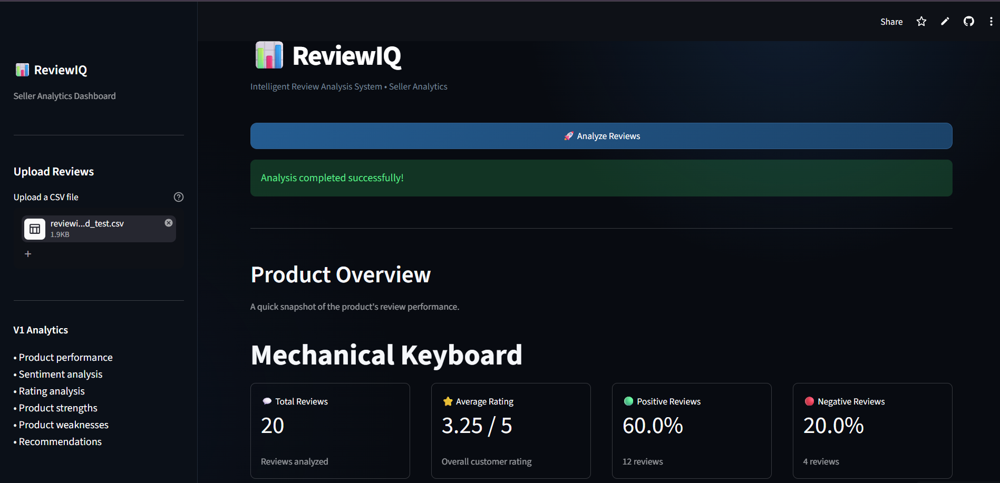
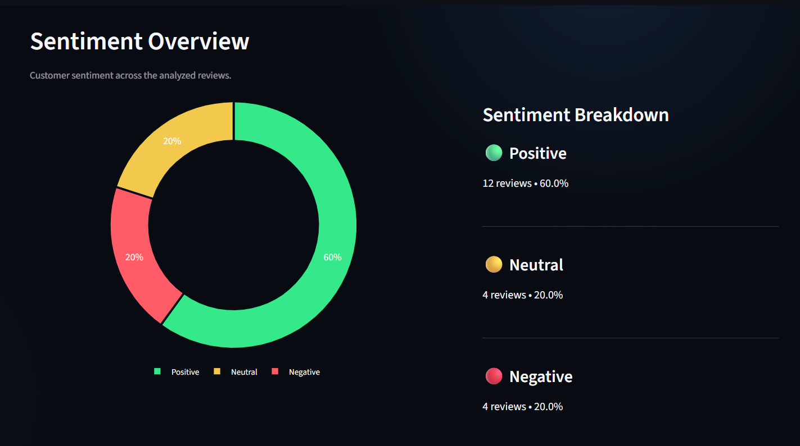
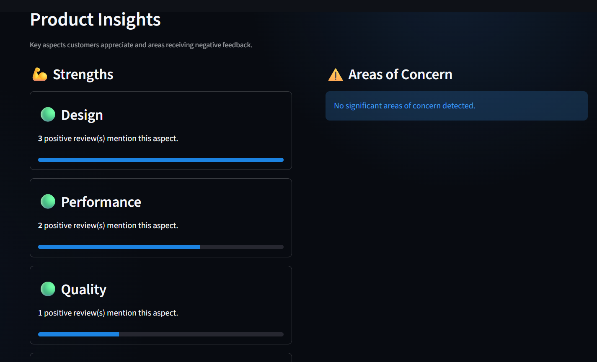
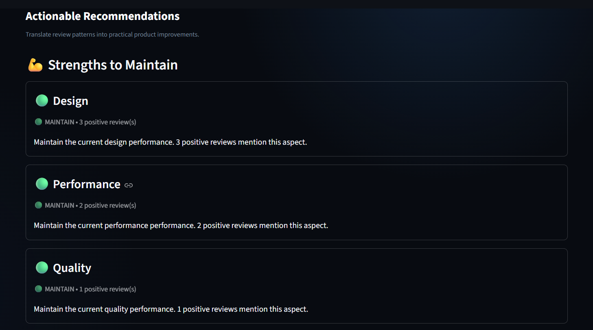

# ReviewIQ - Intelligent Review Analysis System

ReviewIQ is a seller-side analytics dashboard that analyzes e-commerce
product reviews and converts review data into product performance
insights, sentiment trends, strengths, weaknesses, and actionable
recommendations.

## 🌐 Live Demo

🚀 **Try ReviewIQ:** [Open the Live Dashboard](https://reviewiq-mounisha.streamlit.app/)

> Upload a product review CSV and explore sentiment analysis, rating distribution, product strengths, areas of concern, and actionable recommendations.

## 📸 Demo

### Product Overview



The dashboard provides a quick overview of total reviews, average rating, and overall sentiment.

### Sentiment & Rating Analysis



Interactive visualizations show the distribution of positive, neutral, and negative reviews along with the product's rating distribution.

### Product Strengths & Areas of Concern



ReviewIQ identifies frequently mentioned positive and negative product aspects from customer reviews.

### Actionable Recommendations



The system converts review patterns into seller-focused recommendations with priority levels.

## Features

-   Upload product reviews as a CSV file
-   Validate and preprocess review data
-   Clean review text using NLP preprocessing
-   Predict review sentiment using a trained TF-IDF + machine-learning
    model
-   Calculate:
    -   Total reviews
    -   Average rating
    -   Rating distribution
    -   Positive / neutral / negative review counts
    -   Sentiment percentages
-   Identify product strengths from positive review patterns
-   Identify product weaknesses / areas of concern from negative review
    patterns
-   Generate seller-focused recommendations

## How It Works

``` text
CSV Review Dataset
        ↓
Column Normalization & Validation
        ↓
Text Preprocessing
        ↓
TF-IDF Vectorization
        ↓
Trained Sentiment Model
        ↓
Sentiment Prediction
        ↓
Product & Sentiment Analytics
        ↓
Strengths / Weaknesses
        ↓
Actionable Recommendations
        ↓
Streamlit Seller Dashboard
```

## Project Structure

``` text
ReviewIQ/
│
├── app.py
├── requirements.txt
├── README.md
├── .gitignore
│
├── data/
│   └── amazon_reviews.csv
│
├── models/
│   ├── sentiment_model.pkl
│   └── tfidf_vectorizer.pkl
│
├── src/
│   ├── analytics.py
│   ├── data_processing.py
│   ├── insights.py
│   ├── pipeline.py
│   ├── preprocessing.py
│   ├── sentiment.py
│   └── topics.py
│
└── tests/
```

> Keep only the files that are actually part of the final repository. Do
> not commit the virtual environment or temporary uploaded datasets.

## Input Format

ReviewIQ expects a CSV containing at least:

-   `rating`
-   `review_text`

The current pipeline also supports common Amazon-style column names and
maps them to ReviewIQ fields.

A typical dataset can contain:

``` csv
review_id,product_id,product_name,review_date,rating,review_text
1,P001,Example Product,2026-09-01,5,"Excellent product and very easy to use."
2,P001,Example Product,2026-09-02,2,"The battery drains too quickly."
```

## Running Locally

### 1. Clone the repository

``` bash
git clone <YOUR_GITHUB_REPOSITORY_URL>
cd ReviewIQ
```

### 2. Create and activate a virtual environment

**Windows:**

``` bash
python -m venv .venv
.venv\Scripts\activate
```

### 3. Install dependencies

``` bash
pip install -r requirements.txt
```

### 4. Run ReviewIQ

``` bash
streamlit run app.py
```

The application will open in your browser.

## Model Files

The trained sentiment model and TF-IDF vectorizer are loaded from the
`models/` directory.

Make sure these files are included in the GitHub repository if the
deployed application depends on them:

``` text
models/sentiment_model.pkl
models/tfidf_vectorizer.pkl
```

If these files are too large for normal Git, use Git LFS or move model
storage to an appropriate model/artifact service.

## Deployment

ReviewIQ is designed to be deployed using Streamlit Community Cloud.

1.  Push the project to GitHub.
2.  Make sure `app.py` is committed.
3.  Make sure `requirements.txt` is in the repository root.
4.  Make sure all required source files and model files are committed.
5.  Open Streamlit Community Cloud.
6.  Connect your GitHub account.
7.  Create an app using:
    -   **Repository:** your ReviewIQ repository
    -   **Branch:** `main`
    -   **Main file:** `app.py`
8.  Deploy.
9.  After deployment, test the live app with more than one CSV dataset.

## Recommended Repository Hygiene

Do not commit:

``` text
.venv/
**/__pycache__/
*.pyc
.streamlit/secrets.toml
data/uploaded_reviews.csv
```

Avoid committing private credentials, API keys, passwords, or other
secrets.

## Current V1 Scope

The current version focuses on seller-side analytics:

-   Product overview
-   Sentiment overview
-   Rating analysis
-   Product strengths
-   Areas of concern
-   Actionable recommendations

Customer-facing insights are intentionally outside the current V1 scope.

## Future Improvements

Possible future versions can add:

-   Topic-level trend analysis
-   Review volume over time
-   Aspect-level sentiment scoring
-   More robust product/category extraction
-   Review filtering and search
-   Seller comparison dashboards
-   Exportable analytics reports
-   Improved recommendation prioritization
-   Support for larger datasets
-   Additional e-commerce data sources
-   Model performance monitoring and retraining

## Tech Stack

-   Python
-   Streamlit
-   Pandas
-   Plotly
-   Scikit-learn
-   NLP preprocessing
-   TF-IDF
-   Machine Learning
-   Joblib / serialized model artifacts

## Project Goal

ReviewIQ aims to turn large volumes of unstructured customer reviews
into clear seller-side signals that can help identify what customers
value, what problems repeatedly appear in reviews, and which product
areas require attention.

## Author

**Mounisha Vuppu**

